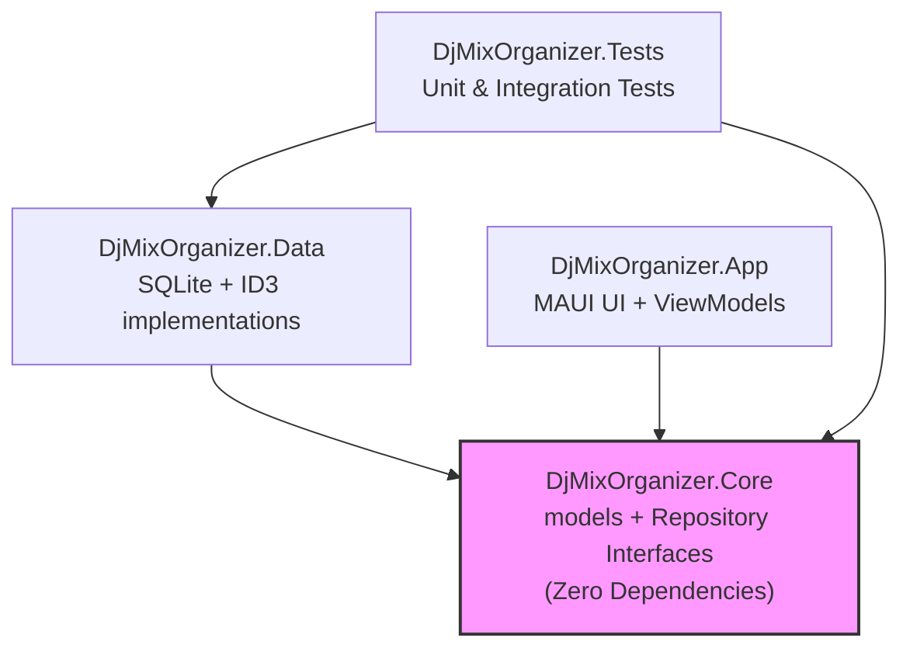
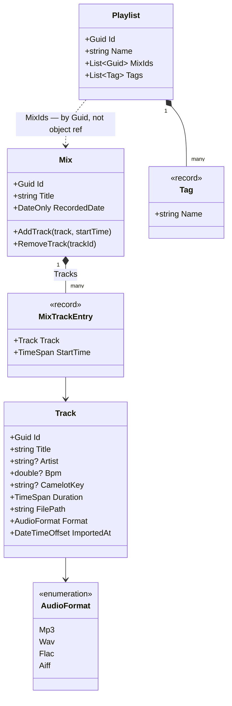
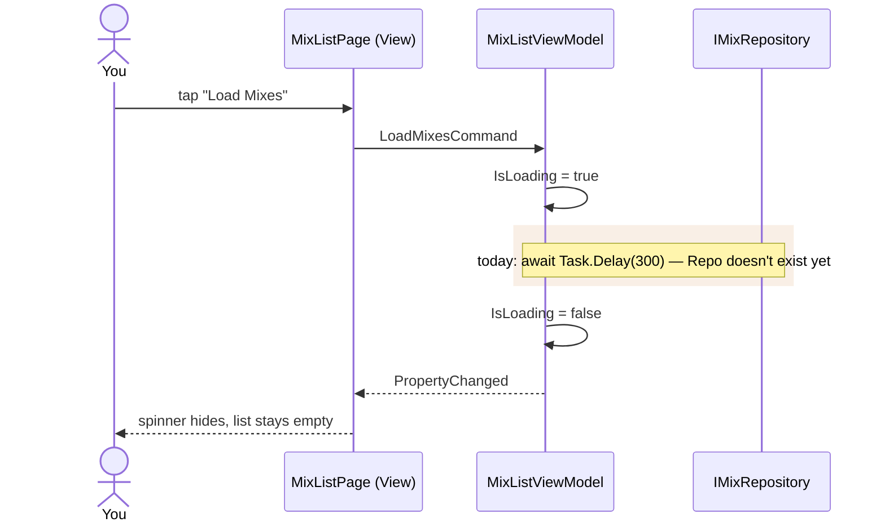
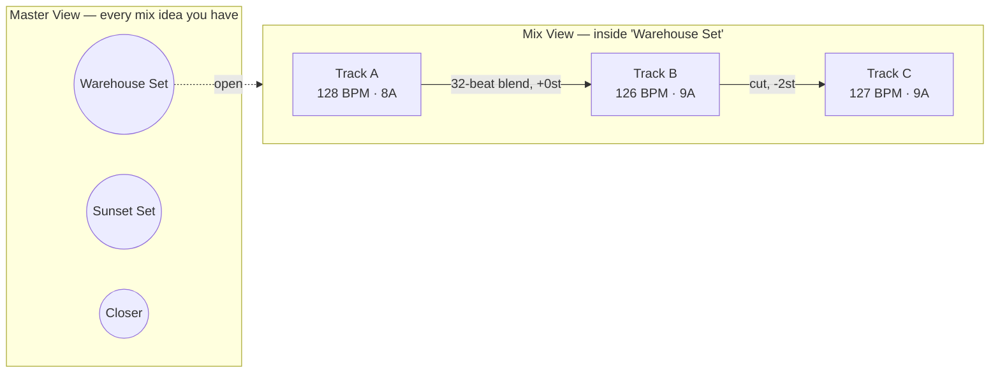
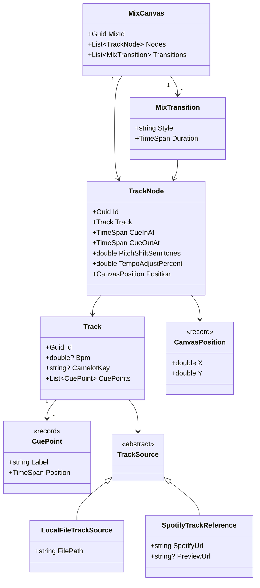

# DJ Mix Organizer — Learning Roadmap

- App – the UI (MixListPage, etc.)
- Core – models like Mix, Track, Playlist
- Data – data layer
- Tests – unit test

This project exists to do two things at once: give you a real tool you'll
actually use and excersize knowledge of c# and maui.

## Why the architecture looks the way it does

We're using a **multi-project solution** instead of one flat MAUI app:

```
DjMixOrganizer.sln
├── DjMixOrganizer.Core/       <- domain models, interfaces, business logic
│                                 (no UI, no database — pure C#)
├── DjMixOrganizer.Data/       <- SQLite persistence, file I/O, ID3 parsing
│                                 (implements Core's interfaces)
├── DjMixOrganizer.App/        <- MAUI UI, ViewModels, XAML views
│                                 (depends on Core + Data)
└── DjMixOrganizer.Tests/      <- unit tests against Core + Data
```

This is **Clean Architecture / Onion Architecture** in miniature: dependencies
point *inward*. The UI depends on Core; Core depends on nothing. This matters
for the interview for two reasons:

1. It's exactly the kind of separation you'll be expected to *read and
   navigate* in an existing embedded/vehicle-control codebase — business
   logic that has to run correctly regardless of which UI or hardware layer
   sits on top of it.
2. It lets us swap the MAUI app for, say, a console tool or a background
   service later without touching business logic — the same reason real
   systems separate a "controller" layer from the physical I/O layer.

## MAUI ↔ Flutter, conceptually

Since Flutter/React is the named comparison point in the posting, here's the
direct mapping so you can speak to both fluently:

| Concept | Flutter | .NET MAUI |
|---|---|---|
| UI description | Widget tree (Dart) | XAML markup (declarative, like Widget tree) |
| Reactive state | `StatefulWidget` + `setState`, or Provider/Bloc | MVVM: `ObservableObject` + data-binding |
| Cross-platform target | Compiles to native ARM via Dart AOT | Compiles to native via .NET NativeAOT/Mono |
| Platform-specific code | `Platform.isAndroid` checks, platform channels | `#if ANDROID` partial classes, `DependencyService` |
| Hot reload | Yes | Yes |
| State management library | Provider, Riverpod, Bloc | CommunityToolkit.Mvvm (`[ObservableProperty]`, `[RelayCommand]`) |

The mental model is identical: **declarative UI + a reactive state layer +
platform-specific escape hatches when you need real hardware access**
(camera, BLE, kiosk mode). That last part is exactly what "Android
provisioning / kiosk / hardware integration" is asking about — MAUI gives you
that same escape hatch via `DependencyService` or partial classes per
platform.

## Phase plan

1. ✅ **Solution + domain models** — Track, Mix, Playlist, Tag exist in
   `DjMixOrganizer.Core` with real invariants (no duplicate start times,
   encapsulated collections). Get comfortable with C# records, nullable
   reference types, and why we keep this project dependency-free.
2. ✅ **MVVM + data-binding** — `MixListViewModel`/`MixListPage` are wired
   through DI (`MauiProgram.cs`), and `LoadMixesCommand` calls a real
   `IMixRepository` (`InMemoryMixRepository` for now) instead of stubbing
   with `Task.Delay`.
3. ⬜ **ID3 tag parsing** — reading raw bytes from an mp3 file header by hand
   before reaching for a library, so you understand the binary format.
   `DjMixOrganizer.Data` currently has no code at all — just a `.csproj`
   referencing Core.
4. ⬜ **Concurrency** — `async`/`await`, `IProgress<T>`, `CancellationToken`
   for scanning a folder of mixes without freezing the UI. Blocked on Phase
   3 (needs something to scan) and an `IMixRepository` interface in Core.
5. ⬜ **FFmpeg interop** — `Process.Start` to shell out for mp3 clip export.
   Same shape as talking to an external tool/daemon over a process boundary.
6. ⬜ **Docker** — containerize a small companion service (e.g. a headless
   "library scanner" API) so you get real `Dockerfile` reps even though the
   MAUI client itself isn't containerized.
7. ⬜ **GitHub Actions** — CI pipeline: restore, build, test on every push.
   No workflow files exist in the repo yet.
8. 🔶 **Android target + kiosk discussion** — iOS builds and runs today (see
   "How to Run" above). Android is untested, and the kiosk/`LockTask`
   discussion hasn't started.

Two loose ends worth cleaning up independent of what's next: `MainPage.xaml`
is the unmodified `dotnet new maui` template screen — `AppShell` already
routes straight to `MixListPage` and never references `MainPage`, so it's
dead code. And `DjMixOrganizer.Tests` has exactly one empty test method.

## Getting this running on your machine

This sandbox can't run MAUI builds (no Android/iOS SDKs, no NuGet access),
so run these locally:

```bash
# Install the MAUI workload (one-time)
dotnet workload install maui

# From an empty folder:
dotnet new sln -n DjMixOrganizer

dotnet new classlib -n DjMixOrganizer.Core -o DjMixOrganizer.Core
dotnet new classlib -n DjMixOrganizer.Data -o DjMixOrganizer.Data
dotnet new maui -n DjMixOrganizer.App -o DjMixOrganizer.App
dotnet new xunit -n DjMixOrganizer.Tests -o DjMixOrganizer.Tests

dotnet sln add DjMixOrganizer.Core DjMixOrganizer.Data DjMixOrganizer.App DjMixOrganizer.Tests

# Wire up project references (Core has none; Data and App depend inward)
dotnet add DjMixOrganizer.Data reference DjMixOrganizer.Core
dotnet add DjMixOrganizer.App reference DjMixOrganizer.Core DjMixOrganizer.Data
dotnet add DjMixOrganizer.Tests reference DjMixOrganizer.Core DjMixOrganizer.Data

# Add the MVVM toolkit to the App project
dotnet add DjMixOrganizer.App package CommunityToolkit.Mvvm
```

Then copy the files from this delivery into the matching folders (paths
noted at the top of each file) and `dotnet build`.

## How to Run

```bash
cd /Users/RamyaSamudrala/Developer/music/djmixer
open -a Simulator
dotnet build DjMixOrganizer.App/DjMixOrganizer.App.csproj -t:Run -f net10.0-ios -r iossimulator-arm64

cd /Users/RamyaSamudrala/Developer/music/djmixer
dotnet build DjMixOrganizer.App/DjMixOrganizer.App.csproj -f net10.0-ios -r iossimulator-arm64
dotnet build DjMixOrganizer.App/DjMixOrganizer.App.csproj -t:Run -f net10.0-ios -r iossimulator-arm64

```

If `actool` fails with "No simulator runtime version ... available to use
with iphonesimulator SDK version", Xcode's bundled SDK is newer than any
installed simulator runtime — fix once with:
`xcodebuild -downloadPlatform iOS`.

## System diagrams (current state)

### Project dependencies



### Domain model



`Playlist` holds `List<Guid>`, not `List<Mix>` — loading a playlist's name
for a list screen shouldn't force-load every mix and every track inside it.
`Track` is a class (mutable identity — you re-tag it over time);
`MixTrackEntry` and `Tag` are records (values — two identical ones are
interchangeable).

### Current MVVM flow (mix list screen)



A rendered, styled version of these diagrams plus the notes below is also
available as a standalone page:
https://claude.ai/code/artifact/a2365250-ef4b-40e3-9d76-2b1f67d6908b

## Design notes: node-based mix editor (brainstorm, not a spec)

This is the biggest pivot from the phase plan above, so treat it as a
direction to react to, not a committed design.

**Two canvases, two node types.** A *Master View* where each node is a mix
idea (recorded or not), and a *Mix View* — opened from a Master View node —
where each node is a track placed inside that one mix, connected by edges
that represent the transition between them.



**The modeling question this raises:** BPM, key, and cue points are
properties of the *track itself* — true no matter which mix it appears in.
Pitch shift, tempo adjustment, and "where in this mix does it start" are
properties of *this track's use in this specific mix* — the same song can be
pitched +0 in one set and -3 semitones in another. `MixTrackEntry` already
gets this right for start-time; a node editor just extends that same
pattern instead of bolting pitch/tempo onto `Track` directly.



`MixCanvas` is deliberately separate from `Mix` — canvas layout (node
positions) is presentation state, not domain logic, same reasoning as why
`Playlist` holds Guids instead of objects.

Worth naming honestly: MAUI has no built-in node-graph control. This means
hand-rolling a canvas with `GraphicsView` (draw nodes/edges yourself, frame
by frame) plus `PanGestureRecognizer`/`DragGestureRecognizer` for dragging
nodes around — a real, multi-week UI engineering effort on top of the
existing phase plan, not a control you drop in.

### Spotify integration: the actual constraint

**Spotify's Web API no longer gives new apps audio analysis.** Since
November 2024, the Audio Features and Audio Analysis endpoints (tempo, key,
energy) are restricted to apps that already had Extended Quota approval
before the cutoff — a new app registered today cannot pull BPM or key from
Spotify's catalog data at all.

Separately, and unrelated to that cutoff: Spotify's terms have never
allowed downloading or capturing raw audio from a stream. Playback goes
through their SDK as a black box; there's no PCM data to run your own
BPM/key/pitch detection against, even if you wanted to compute it yourself.

Net effect: if Spotify gets integrated, treat it as a way to **browse your
library / pull track and artist metadata for building a mix's tracklist
idea** — not as a source of BPM, key, or cue data. That analysis only works
for audio you actually hold the bytes for, which in this app means Phase 3
(ID3/local files) — already on the roadmap.

### Pairing metadata with pro DJ software

"DJ Pro" software generally (Serato, rekordbox, Engine DJ, djay Pro)
converges on the same handful of fields, but stores them differently:

| Field | Where it usually lives | Notes |
|---|---|---|
| BPM | ID3v2 `TBPM` frame | Universally read by every app — the safest field to write. |
| Key | ID3v2 `TKEY` frame | Camelot ("8A") vs. Open Key ("6m") is a per-app display setting, not a different tag — pick one and be consistent. |
| Cue points / hot cues | App-proprietary binary tags | Serato writes custom `GEOB` frames ("Serato Markers2") — reverse-engineered, undocumented, and fragile to write to directly. |
| Beatgrid | App-proprietary | Engine DJ keeps its own SQLite database for USB export; not a tag on the file at all. |
| Playlists/crates | rekordbox XML | The one format with the broadest cross-app import support if the goal is moving organized sets between tools. |

Recommendation, given the interop is genuinely fragile: write standard
`TBPM`/`TKEY` ID3v2 tags for baseline compatibility everywhere, and if you
want organized sets to show up as playlists in whatever software you
actually mix in, target a rekordbox-XML export rather than reverse-engineering
one vendor's binary cue-point format.

And the modeling point above still applies: BPM/key/cue points belong on
`Track` (intrinsic to the audio); pitch shift and tempo adjustment belong on
the per-mix node (`TrackNode`) — because that's genuinely how DJ software
itself treats them.

## Git workflow: branches, pushing, merging

This repo lives at `origin` → `https://github.com/samudraam/DjMixOrganizer`,
tracked from local `main`. The 8 roadmap/housekeeping issues opened on
GitHub are meant to be worked one branch at a time using the flow below.

### The mental model

`main` should always be in a state you'd be okay building from. You never
edit it directly for real work — instead:

1. Branch off `main` for one issue/feature.
2. Commit your changes on that branch.
3. Push the branch to GitHub.
4. Open a Pull Request (PR) — this is where the *diff* gets reviewed before
   it becomes part of `main`.
5. Merge the PR. `main` now has your change; your branch can be deleted.

The branch is a scratch space — as many messy, half-working commits as you
want — that only gets combined into `main` once it's ready.

### Everyday commands

**Start a new branch for an issue** (always branch from an up-to-date
`main`):

```bash
git checkout main
git pull                              # make sure you're starting from the latest main
git checkout -b task1-mix-repository  # creates AND switches to the new branch
```

Name branches after what they do, not who's doing it —
`task1-mix-repository`, `phase3-id3-parsing`, `fix-dead-mainpage`. This
repo's issues map 1:1 to good branch names; e.g. Issue #1 → `task1-mix-repository`.

**Make your changes, then commit them:**

```bash
git status                 # see what you've touched
git add DjMixOrganizer.Core/Repositories/IMixRepository.cs
git add DjMixOrganizer.Data/Repositories/InMemoryMixRepository.cs
git commit -m "Add IMixRepository and in-memory implementation"
```

Prefer several small, focused commits over one giant one — each commit
should be a single coherent step, not "end of day checkpoint."

**Push the branch to GitHub** (`-u` only needed the *first* time you push
this branch — it links your local branch to a remote one so future `git
push`/`git pull` on this branch don't need any arguments):

```bash
git push -u origin task1-mix-repository
```

**Open a Pull Request.** Either follow the URL that `git push` printed
after your first push, or use the GitHub CLI already set up for this repo:

```bash
gh pr create --title "Task 1: real IMixRepository" --body "Closes #1"
```

Writing `Closes #1` in the PR body auto-closes that issue the moment the PR
merges — no manual bookkeeping.

**Merge it.** Once you've looked over the diff on GitHub (or just decide
it's ready, since you're a team of one right now):

```bash
gh pr merge --merge     # or --squash, see below
```

**Get the merged change back onto your local `main`**, and clean up the
now-merged branch:

```bash
git checkout main
git pull
git branch -d task1-mix-repository          # delete local branch
git push origin --delete task1-mix-repository  # delete remote branch (optional)
```

### `--merge` vs. `--squash` vs. `--rebase`

`gh pr merge` (and GitHub's UI) offer three strategies:

| Strategy | What `main`'s history looks like after | When to use it |
|---|---|---|
| **Merge commit** (`--merge`) | All your branch's individual commits appear on `main`, plus one extra "merge" commit tying them together. | You want to preserve the exact step-by-step history of how you got there. |
| **Squash** (`--squash`) | All your branch's commits get flattened into a single commit on `main`. | You made a bunch of messy "wip", "fix typo", "actually fix it" commits and only the *end result* is worth keeping — this is usually the right default for a solo project. |
| **Rebase** (`--rebase`) | Your commits are replayed one-by-one on top of `main`, with no merge commit at all — history looks perfectly linear. | You care about a clean linear history and your commits were already well-organized. |

For this project, **squash merging** is the sane default — you'll have
plenty of "oops" commits while learning C#/MAUI syntax, and nobody needs to
see those preserved forever in `main`'s history.

### If two branches touched the same lines: merge conflicts

If `main` moved on while your branch was open (say, you merged Task 1's
branch, then came back to an older branch that also touched
`MauiProgram.cs`), Git won't be able to auto-combine both versions of that
file. You'll see something like this when you try to merge or rebase:

```
<<<<<<< HEAD
builder.Services.AddSingleton<IMixRepository, InMemoryMixRepository>();
=======
builder.Services.AddSingleton<ITrackRepository, InMemoryTrackRepository>();
>>>>>>> task1-mix-repository
```

Everything between `<<<<<<< HEAD` and `=======` is what's already on the
branch you're merging *into*; everything between `=======` and `>>>>>>>` is
what's coming in from the *other* branch. Open the file, decide what the
combined result should actually be (often it's "keep both lines"), delete
the `<<<<<<<`/`=======`/`>>>>>>>` markers by hand, save, then:

```bash
git add MauiProgram.cs
git commit          # finishes the merge — Git already knows this resolves the conflict
```

There's no magic command that resolves conflicts for you — reading the
markers and deciding what's correct is the whole job. The upshot of small,
frequent PRs (like one per issue above) is that conflicts stay small and
rare instead of becoming a 20-file nightmare.

### Quick reference

```bash
git checkout -b <branch-name>              # new branch from current one
git push -u origin <branch-name>           # first push of a new branch
git push                                    # every push after that
git pull                                    # bring your branch up to date with its remote
gh pr create                                # open a PR for the current branch
gh pr merge --squash                        # merge it in, flattened to one commit
git checkout main && git pull               # get the merged result locally
git branch -d <branch-name>                 # delete the local branch once merged
```