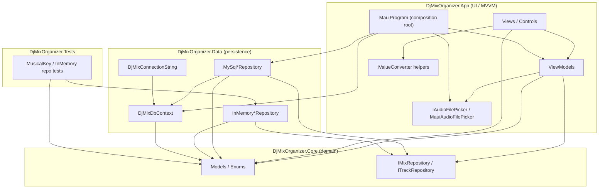
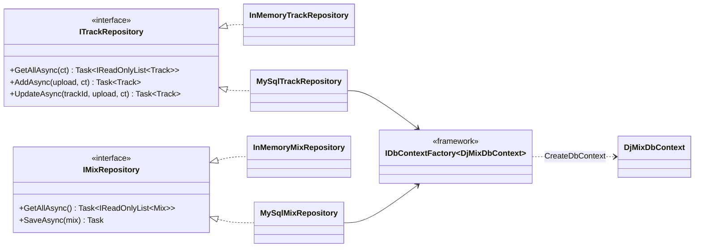
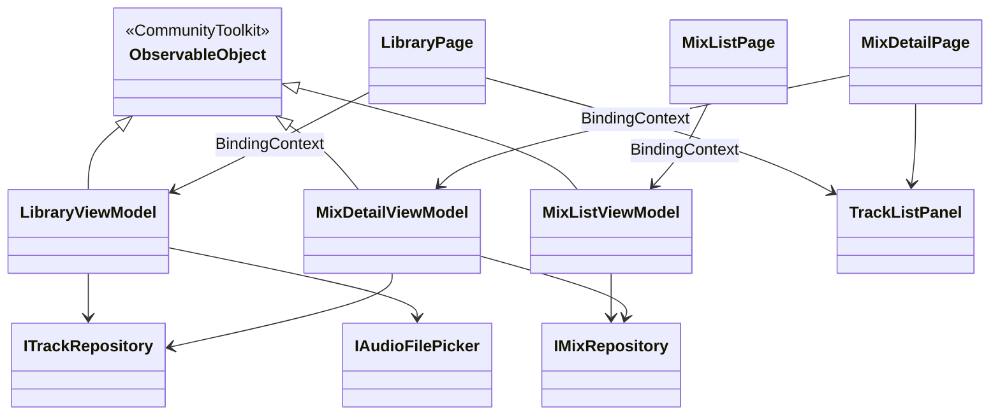
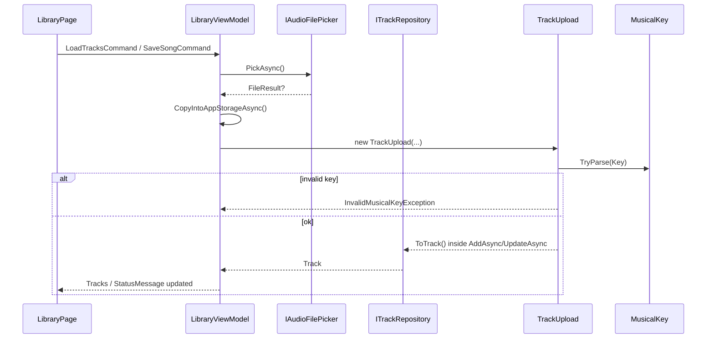
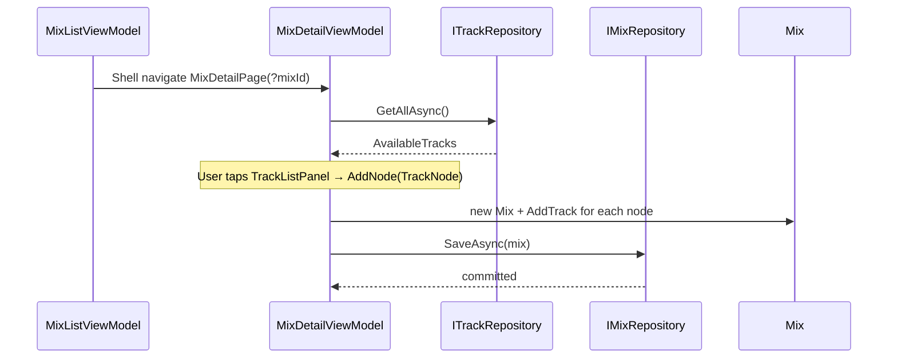

# DJ Mix Organizer — System Class Diagram

This document is a **system-level class diagram** of everything currently built in the `DjMixOrganizer` solution. Use it as a map of *who owns what*, *who calls whom*, and *what methods each type exposes*.

> **How to view the diagrams**
>
> - In **VS Code / Cursor**: open this file and use the Markdown preview (Mermaid renders in-editor).
> - On **GitHub**: Mermaid blocks render automatically in the PR / file view.
> - Online: paste a Mermaid block into [mermaid.live](https://mermaid.live).

---

## 1. Solution architecture (layers)

```
DjMixOrganizer.sln
├── DjMixOrganizer.Core/     Domain models + repository interfaces (no UI, no DB)
├── DjMixOrganizer.Data/     EF Core + MySQL + in-memory repository implementations
├── DjMixOrganizer.App/      MAUI UI, ViewModels, converters, DI composition root
└── DjMixOrganizer.Tests/    Unit tests against Core + Data
```

**Dependency rule (Clean / Onion Architecture):** arrows point *inward*.  
`App → Core ← Data`. Core never references App or Data.




---


## 2. Full system class diagram (relationships)

This Mermaid diagram shows the main types and how they connect.  
Member lists for every type are in the sections that follow.

```mermaid
classDiagram
    direction TB

    %% ===== CORE ENUMS / VALUE TYPES =====
    class AudioFormat {
        <<enumeration>>
        Mp3
        Wav
        Flac
        Aiff
    }

    class MusicalKey {
        <<readonly record struct>>
        +IReadOnlyList~string~ All$
        +string Value
        +MusicalKey(string value)
        +string ToString()
        +bool TryParse(string? input, out MusicalKey key)$
        +MusicalKey Parse(string input)$
    }

    class InvalidMusicalKeyException {
        <<exception>>
        +string AttemptedKey
        +InvalidMusicalKeyException(string attemptedKey)
    }

    class CanvasPosition {
        <<record>>
        +double X
        +double Y
    }

    class Tag {
        <<record>>
        +string Name
    }

    class MixTrackEntry {
        <<record>>
        +Track Track
        +TimeSpan StartTime
    }

    class TrackUpload {
        <<sealed record>>
        +string Title
        +string? Artist
        +double? Bpm
        +string? Key
        +TimeSpan Duration
        +string FilePath
        +AudioFormat Format
        +Track ToTrack()
    }

    %% ===== CORE ENTITIES =====
    class Track {
        +Guid Id
        +string Title
        +string? Artist
        +double? Bpm
        +MusicalKey? MusicalKey
        +TimeSpan Duration
        +string FilePath
        +AudioFormat Format
        +DateTimeOffset ImportedAt
        +string DisplayName
    }

    class Mix {
        +Guid Id
        +string Title
        +DateOnly RecordedDate
        +IReadOnlyList~MixTrackEntry~ Tracks
        +TimeSpan TotalDuration
        +Mix()
        +void AddTrack(Track track, TimeSpan startTime)
        +void RemoveTrack(Guid trackId)
    }

    class TrackNode {
        <<INotifyPropertyChanged>>
        +Guid Id
        +Track Track
        +double Bpm
        +string Key
        +bool HasVocals
        +bool HasPercussion
        +bool HasMusic
        +CanvasPosition Position
        +string AccentColorHex
        +string TrackSectionsText
    }

    class Playlist {
        +Guid Id
        +string Name
        +List~Guid~ MixIds
        +List~Tag~ Tags
    }

    %% ===== CORE REPOSITORY CONTRACTS =====
    class ITrackRepository {
        <<interface>>
        +Task~IReadOnlyList~Track~~ GetAllAsync(CancellationToken ct)
        +Task~Track~ AddAsync(TrackUpload upload, CancellationToken ct)
        +Task~Track~ UpdateAsync(Guid trackId, TrackUpload upload, CancellationToken ct)
    }

    class IMixRepository {
        <<interface>>
        +Task~IReadOnlyList~Mix~~ GetAllAsync()
        +Task SaveAsync(Mix mix)
    }

    %% ===== DATA LAYER =====
    class DjMixConnectionString {
        <<static>>
        +string FromEnvironment()$
    }

    class DjMixDbContext {
        <<DbContext>>
        +DbSet~Track~ Tracks
        +DbSet~Mix~ Mixes
        +DjMixDbContext(DbContextOptions options)
        #void OnModelCreating(ModelBuilder modelBuilder)
    }

    class DjMixDbContextFactory {
        <<IDesignTimeDbContextFactory>>
        +DjMixDbContext CreateDbContext(string[] args)
    }

    class InMemoryTrackRepository {
        +Task~IReadOnlyList~Track~~ GetAllAsync(CancellationToken ct)
        +Task~Track~ AddAsync(TrackUpload upload, CancellationToken ct)
        +Task~Track~ UpdateAsync(Guid trackId, TrackUpload upload, CancellationToken ct)
    }

    class MySqlTrackRepository {
        +MySqlTrackRepository(IDbContextFactory factory)
        +Task~IReadOnlyList~Track~~ GetAllAsync(CancellationToken ct)
        +Task~Track~ AddAsync(TrackUpload upload, CancellationToken ct)
        +Task~Track~ UpdateAsync(Guid trackId, TrackUpload upload, CancellationToken ct)
    }

    class InMemoryMixRepository {
        +InMemoryMixRepository()
        +Task~IReadOnlyList~Mix~~ GetAllAsync()
        +Task SaveAsync(Mix mix)
    }

    class MySqlMixRepository {
        +MySqlMixRepository(IDbContextFactory factory)
        +Task~IReadOnlyList~Mix~~ GetAllAsync()
        +Task SaveAsync(Mix mix)
    }

    %% ===== APP SERVICES =====
    class IAudioFilePicker {
        <<interface>>
        +Task~FileResult?~ PickAsync(CancellationToken ct)
    }

    class MauiAudioFilePicker {
        <<sealed>>
        +Task~FileResult?~ PickAsync(CancellationToken ct)
    }

    %% ===== APP VIEWMODELS =====
    class SongFormMode {
        <<enumeration>>
        None
        Add
        Edit
    }

    class LibraryViewModel {
        <<ObservableObject>>
        +IReadOnlyList~string~ MusicalKeys$
        +ObservableCollection~Track~ Tracks
        +Track? SelectedTrack
        +bool IsLoading
        +SongFormMode FormMode
        +bool IsSaving
        +string NewTitle
        +string NewArtist
        +string NewBpmText
        +string? NewKey
        +string NewFilePath
        +string NewFileDisplayName
        +string StatusMessage
        +bool IsFormOpen
        +string FormHeading
        +string SaveButtonText
        +IAsyncRelayCommand LoadTracksCommand
        +IRelayCommand BeginAddSongCommand
        +IRelayCommand BeginEditSongCommand
        +IRelayCommand CancelSongFormCommand
        +IAsyncRelayCommand PickAudioFileCommand
        +IAsyncRelayCommand SaveSongCommand
    }

    class MixListViewModel {
        <<ObservableObject>>
        +ObservableCollection~Mix~ Mixes
        +bool IsLoading
        +IAsyncRelayCommand LoadMixesCommand
        +IAsyncRelayCommand CreateMixCommand
        +IAsyncRelayCommand~Mix~ OpenMixCommand
    }

    class MixDetailViewModel {
        <<ObservableObject>>
        <<IQueryAttributable>>
        +IReadOnlyList~string~ MusicalKeys$
        +Mix? Mix
        +bool IsNewMix
        +string MixTitle
        +string StatusMessage
        +bool IsSaving
        +ObservableCollection~TrackNode~ Nodes
        +ObservableCollection~Track~ AvailableTracks
        +Track? SelectedTrackToAdd
        +TrackNode? SelectedNode
        +void ApplyQueryAttributes(IDictionary query)
        +IRelayCommand~TrackNode~ RemoveNodeCommand
        +IAsyncRelayCommand SaveMixCommand
        +IAsyncRelayCommand LoadAvailableTracksCommand
        +IRelayCommand EditColorCommand
    }

    %% ===== APP VIEWS / CONTROLS =====
    class LibraryPage {
        <<ContentPage>>
        +LibraryPage(LibraryViewModel vm)
        #void OnAppearing()
    }

    class MixListPage {
        <<ContentPage>>
        +MixListPage(MixListViewModel vm)
        #void OnAppearing()
    }

    class MixDetailPage {
        <<ContentPage>>
        <<IDrawable>>
        +MixDetailPage(MixDetailViewModel vm)
        +void Draw(ICanvas canvas, RectF dirtyRect)
        #void OnAppearing()
    }

    class TrackListPanel {
        <<ContentView>>
        +IEnumerable? TracksSource
        +Track? SelectedTrack
        +TrackListPanel()
    }

    class AppShell {
        <<Shell>>
        +AppShell()
    }

    class App {
        <<Application>>
        +App()
        #Window CreateWindow(IActivationState? state)
    }

    class MauiProgram {
        <<static>>
        +MauiApp CreateMauiApp()$
    }

    %% ===== RELATIONSHIPS =====
    Track --> AudioFormat : Format
    Track --> MusicalKey : MusicalKey?
    TrackUpload --> AudioFormat : Format
    TrackUpload ..> Track : ToTrack()
    TrackUpload ..> MusicalKey : ParseOptionalKey
    TrackUpload ..> InvalidMusicalKeyException : throws
    Mix "1" *-- "*" MixTrackEntry : Tracks
    MixTrackEntry --> Track : Track
    TrackNode --> Track : Track
    TrackNode --> CanvasPosition : Position
    Playlist "1" *-- "*" Tag : Tags
    Playlist o-- Mix : MixIds (by Guid)

    ITrackRepository <|.. InMemoryTrackRepository
    ITrackRepository <|.. MySqlTrackRepository
    IMixRepository <|.. InMemoryMixRepository
    IMixRepository <|.. MySqlMixRepository

    MySqlTrackRepository --> DjMixDbContext : via factory
    MySqlMixRepository --> DjMixDbContext : via factory
    DjMixDbContext --> Track
    DjMixDbContext --> Mix
    DjMixDbContextFactory ..> DjMixDbContext : creates
    DjMixDbContextFactory ..> DjMixConnectionString : FromEnvironment

    IAudioFilePicker <|.. MauiAudioFilePicker

    LibraryViewModel --> ITrackRepository
    LibraryViewModel --> IAudioFilePicker
    LibraryViewModel --> SongFormMode
    LibraryViewModel ..> TrackUpload : builds
    MixListViewModel --> IMixRepository
    MixDetailViewModel --> IMixRepository
    MixDetailViewModel --> ITrackRepository
    MixDetailViewModel "1" *-- "*" TrackNode : Nodes

    LibraryPage --> LibraryViewModel
    MixListPage --> MixListViewModel
    MixDetailPage --> MixDetailViewModel
    LibraryPage --> TrackListPanel
    MixDetailPage --> TrackListPanel
    App --> AppShell
    MauiProgram ..> MySqlMixRepository : DI register
    MauiProgram ..> MySqlTrackRepository : DI register
    MauiProgram ..> LibraryViewModel : DI register
    MauiProgram ..> MixListViewModel : DI register
    MauiProgram ..> MixDetailViewModel : DI register
```




---


## 3. Core domain — detailed members


### 3.1 Enums


| Type                                         | Kind   | Members                      |
| -------------------------------------------- | ------ | ---------------------------- |
| `DjMixOrganizer.Core.Enums.AudioFormat`      | `enum` | `Mp3`, `Wav`, `Flac`, `Aiff` |
| `DjMixOrganizer.App.ViewModels.SongFormMode` | `enum` | `None`, `Add`, `Edit`        |


### 3.2 `MusicalKey` (`readonly partial record struct`)

Canonical classical letter key (`C`, `Am`, `F#m`, …). Rejects Camelot (`8A`) and Open Key (`6m`).


| Member                                      | Kind              | Signature / notes                                             |
| ------------------------------------------- | ----------------- | ------------------------------------------------------------- |
| `All`                                       | static property   | `IReadOnlyList<string>` — 24 canonical keys for pickers       |
| `Value`                                     | property          | `string` — e.g. `"Am"`                                        |
| ctor                                        | constructor       | `MusicalKey(string value)` — requires already-canonical value |
| `ToString()`                                | method            | returns `Value`                                               |
| `TryParse`                                  | static method     | `bool TryParse(string? input, out MusicalKey key)`            |
| `Parse`                                     | static method     | `MusicalKey Parse(string input)` — throws `FormatException`   |
| `TryNormalize`                              | private           | free-form → canonical string                                  |
| `TryResolveRoot`                            | private           | alias map (`C#` → `Db`, unicode sharp/flat)                   |
| `TrimModeSuffix`                            | private           | strips `maj` / `minor` suffixes                               |
| `BuildAll`                                  | private           | builds the 24-key list                                        |
| `WhitespaceRegex` / `CamelotOrOpenKeyRegex` | private generated | `[GeneratedRegex]` helpers                                    |


### 3.3 `InvalidMusicalKeyException` (`sealed class : Exception`)


| Member         | Kind        | Notes                                             |
| -------------- | ----------- | ------------------------------------------------- |
| `AttemptedKey` | property    | raw rejected text                                 |
| ctor           | constructor | `InvalidMusicalKeyException(string attemptedKey)` |


Thrown by `TrackUpload.ToTrack()` when key text is non-empty but not a letter key. Caught in `LibraryViewModel.SaveSongAsync()`.

### 3.4 `Track` (entity class)


| Member        | Type                | Notes                                            |
| ------------- | ------------------- | ------------------------------------------------ |
| `Id`          | `Guid`              | identity (`init`, default `NewGuid()`)           |
| `Title`       | `required string`   | mutable metadata                                 |
| `Artist`      | `string?`           | optional                                         |
| `Bpm`         | `double?`           | optional until analyzed                          |
| `MusicalKey`  | `MusicalKey?`       | letter key, not Camelot                          |
| `Duration`    | `TimeSpan`          |                                                  |
| `FilePath`    | `required string`   | path string only — Core does no I/O              |
| `Format`      | `AudioFormat`       | default `Mp3`                                    |
| `ImportedAt`  | `DateTimeOffset`    | `init`, default UTC now                          |
| `DisplayName` | `string` (computed) | `"Artist — Title"` or `Title`; **ignored by EF** |


### 3.5 `TrackUpload` (`sealed record`)

Input DTO at the repository write boundary.


| Member                       | Notes                                                                      |
| ---------------------------- | -------------------------------------------------------------------------- |
| Primary ctor props           | `Title`, `Artist?`, `Bpm?`, `Key?`, `Duration`, `FilePath`, `Format = Mp3` |
| `ToTrack()`                  | validates title/path, normalizes key → `Track`                             |
| `ParseOptionalKey` (private) | empty → `null`; invalid → `InvalidMusicalKeyException`                     |


### 3.6 `Mix` (aggregate root class)


| Member                      | Kind         | Notes                                         |
| --------------------------- | ------------ | --------------------------------------------- |
| `Id`                        | property     | `Guid`                                        |
| `Title`                     | property     | `required string`                             |
| `RecordedDate`              | property     | `DateOnly`                                    |
| `Tracks`                    | property     | `IReadOnlyList<MixTrackEntry>` — encapsulated |
| `TotalDuration`             | property     | sum of track durations                        |
| `Mix()`                     | public ctor  | empty track list                              |
| `Mix(List<MixTrackEntry>)`  | private ctor | EF materialization path                       |
| `AddTrack(Track, TimeSpan)` | method       | rejects duplicate `StartTime`, then sorts     |
| `RemoveTrack(Guid)`         | method       | removes by track id                           |


### 3.7 `MixTrackEntry` (`record`)


| Member                            | Notes                               |
| --------------------------------- | ----------------------------------- |
| `Track Track`                     | related library track               |
| `TimeSpan StartTime`              | placement in the mix timeline       |
| private `MixTrackEntry(TimeSpan)` | EF ctor; `Track` set via reflection |


EF maps table `MixTrackEntries` with composite key `(MixId, TrackId)`.

### 3.8 `TrackNode` + `CanvasPosition` (mix-editor presentation)

`CanvasPosition` is a simple positional record: `(double X, double Y)`.

`TrackNode` implements `INotifyPropertyChanged` by hand (Core stays free of CommunityToolkit).


| Member                                   | Observable?        | Notes                                                    |
| ---------------------------------------- | ------------------ | -------------------------------------------------------- |
| `Id`                                     | no (`init`)        | node identity on canvas                                  |
| `Track`                                  | no                 | library track being placed                               |
| `Bpm`, `Key`                             | **yes**            | per-mix overrides                                        |
| `HasVocals`, `HasPercussion`, `HasMusic` | **yes**            | stem-ish toggles                                         |
| `Position`                               | **no** (by design) | drag uses visual `TranslationX/Y`; commit on gesture end |
| `AccentColorHex`                         | **yes**            | border / waveform color                                  |
| `TrackSectionsText`                      | **yes**            | free-text cue ranges for now                             |


Private helper: `OnPropertyChanged([CallerMemberName])`.

### 3.9 `Playlist` + `Tag` (domain stub — not wired to UI/DB yet)


| Type       | Members                                             |
| ---------- | --------------------------------------------------- |
| `Playlist` | `Id`, `Name`, `List<Guid> MixIds`, `List<Tag> Tags` |
| `Tag`      | positional record `(string Name)`                   |


---


## 4. Repository contracts & implementations




### 4.1 `ITrackRepository` / `IMixRepository`

Defined in `DjMixOrganizer.Core/Repositories/`.

### 4.2 In-memory implementations (`DjMixOrganizer.Data/Repositories/`)


| Class                     | Implements         | Behavior                                                         |
| ------------------------- | ------------------ | ---------------------------------------------------------------- |
| `InMemoryTrackRepository` | `ITrackRepository` | seeded `List<Track>`; `Add`/`Update` via `TrackUpload.ToTrack()` |
| `InMemoryMixRepository`   | `IMixRepository`   | seeded mixes; `SaveAsync` insert-or-replace by `Id`              |


Used by unit tests and offline/dev scenarios.

### 4.3 MySQL implementations


| Class                  | Constructor                           | Behavior                                                                                    |
| ---------------------- | ------------------------------------- | ------------------------------------------------------------------------------------------- |
| `MySqlTrackRepository` | `(IDbContextFactory<DjMixDbContext>)` | fresh context per op; insert / field-update                                                 |
| `MySqlMixRepository`   | `(IDbContextFactory<DjMixDbContext>)` | eager `Include` tracks; re-resolves `Track` by id before attach (disconnected graph safety) |


### 4.4 EF Core mapping (`DjMixDbContext`)


| API                   | Notes                                                                                                                                             |
| --------------------- | ------------------------------------------------------------------------------------------------------------------------------------------------- |
| `DbSet<Track> Tracks` |                                                                                                                                                   |
| `DbSet<Mix> Mixes`    |                                                                                                                                                   |
| `OnModelCreating`     | ignores `Track.DisplayName`; converts `MusicalKey ↔ string` (`varchar(8)`); `Mix.Tracks` field access; `MixTrackEntry` composite key + table name |


Supporting types:


| Type                                      | Role                                                                      |
| ----------------------------------------- | ------------------------------------------------------------------------- |
| `DjMixConnectionString.FromEnvironment()` | builds MySQL connection string from `MYSQL_*` env vars                    |
| `DjMixDbContextFactory`                   | design-time `IDesignTimeDbContextFactory<DjMixDbContext>` for `dotnet ef` |


### 4.5 Migrations (EF)


| Migration                      | Purpose                                      |
| ------------------------------ | -------------------------------------------- |
| `InitialCreate`                | creates `Mixes`, `Tracks`, `MixTrackEntries` |
| `RenameCamelotKeyToMusicalKey` | column rename + length/type cleanup          |
| `CanonicalizeDbMusicalKey`     | data fix (`C#`→`Db`, `C#m`→`Dbm`)            |


Each has protected `Up` / `Down`. Designer + snapshot files are generated artifacts.

---


## 5. App layer (MVVM) — detailed members




### 5.1 `LibraryViewModel`

**Injected:** `ITrackRepository`, `IAudioFilePicker`


| Category         | Members                                                                                                                                                               |
| ---------------- | --------------------------------------------------------------------------------------------------------------------------------------------------------------------- |
| Static           | `MusicalKeys` → `MusicalKey.All`                                                                                                                                      |
| Observable props | `Tracks`, `SelectedTrack`, `IsLoading`, `FormMode`, `IsSaving`, `NewTitle`, `NewArtist`, `NewBpmText`, `NewKey`, `NewFilePath`, `NewFileDisplayName`, `StatusMessage` |
| Computed         | `IsFormOpen`, `FormHeading`, `SaveButtonText`                                                                                                                         |
| Commands         | `LoadTracksCommand`, `BeginAddSongCommand`, `BeginEditSongCommand`, `CancelSongFormCommand`, `PickAudioFileCommand`, `SaveSongCommand`                                |
| Private helpers  | `ResetForm`, `FormatException`, `CopyIntoAppStorageAsync`, `IsSupportedAudioFile`, `GuessFormat`, `OnFormModeChanged`                                                 |


### 5.2 `MixListViewModel`

**Injected:** `IMixRepository`


| Category         | Members                                                            |
| ---------------- | ------------------------------------------------------------------ |
| Observable props | `Mixes`, `IsLoading`                                               |
| Commands         | `LoadMixesCommand`, `CreateMixCommand`, `OpenMixCommand`           |
| Navigation       | `Shell.Current.GoToAsync` → `MixDetailPage` (+ optional `?mixId=`) |


### 5.3 `MixDetailViewModel` (`IQueryAttributable`)

**Injected:** `IMixRepository`, `ITrackRepository`


| Category         | Members                                                                                                                      |
| ---------------- | ---------------------------------------------------------------------------------------------------------------------------- |
| Static           | `MusicalKeys`                                                                                                                |
| Observable props | `Mix`, `IsNewMix`, `MixTitle`, `StatusMessage`, `IsSaving`, `Nodes`, `AvailableTracks`, `SelectedTrackToAdd`, `SelectedNode` |
| Public API       | `ApplyQueryAttributes(IDictionary<string, object> query)`                                                                    |
| Commands         | `RemoveNodeCommand`, `SaveMixCommand`, `LoadAvailableTracksCommand`, `EditColorCommand`                                      |
| Private helpers  | `AddNode`, `OnSelectedTrackToAddChanged`, `CanSaveMix`, `FormatException`                                                    |


**Save flow (important):** builds a new `Mix`, calls `AddTrack` with cumulative start times, then `_mixRepository.SaveAsync(mix)` on a thread-pool thread with a 15s timeout.

### 5.4 Views & control


| Type             | Base                       | Key members                                                                     |
| ---------------- | -------------------------- | ------------------------------------------------------------------------------- |
| `LibraryPage`    | `ContentPage`              | ctor injects VM; `OnAppearing` → `LoadTracksCommand`                            |
| `MixListPage`    | `ContentPage`              | ctor injects VM; `OnAppearing` → `LoadMixesCommand`                             |
| `MixDetailPage`  | `ContentPage`, `IDrawable` | `Draw`, drag handlers (`OnNodePanUpdated`), `OnNodeCardLoaded`, `OnBackClicked` |
| `TrackListPanel` | `ContentView`              | bindable `TracksSource`, two-way `SelectedTrack`                                |
| `App`            | `Application`              | `CreateWindow` → `AppShell`                                                     |
| `AppShell`       | `Shell`                    | registers `MixDetailPage` route; Library + Mixes tabs                           |


### 5.5 Services


| Type                  | Members                                                    |
| --------------------- | ---------------------------------------------------------- |
| `IAudioFilePicker`    | `Task<FileResult?> PickAsync(CancellationToken = default)` |
| `MauiAudioFilePicker` | implements picker; ensures UI-thread invocation            |


### 5.6 Converters (`IValueConverter`)

All expose `Convert` / `ConvertBack` (`ConvertBack` usually throws `NotSupportedException`).


| Converter                            | Input → Output                                                |
| ------------------------------------ | ------------------------------------------------------------- |
| `InvertedBoolConverter`              | `bool` ↔ inverted `bool`                                      |
| `CanvasPositionToBoundsConverter`    | `CanvasPosition` → `Rect` (`CardWidth=230`, `CardHeight=260`) |
| `HexToColorConverter`                | hex `string` → `Color`                                        |
| `HexToDarkerColorConverter`          | hex `string` → darkened `Color`                               |
| `TrackNodeToWaveformBarsConverter`   | `TrackNode` → `double[]` fake waveform bars                   |
| `MixTitleToFormattedStringConverter` | `Mix` → colorized `FormattedString` titles                    |
| `MixArtistsToStringConverter`        | `Mix` → `"Artist x Artist"` string                            |


### 5.7 Composition root — `MauiProgram`


| Method                           | Role                                           |
| -------------------------------- | ---------------------------------------------- |
| `CreateMauiApp()`                | builds MAUI app, registers DI, runs migrations |
| `LoadBundledEnvVars()` (private) | reads bundled `local.env` into process env     |


**DI registrations (production):**


| Service                                | Lifetime      | Implementation                           |
| -------------------------------------- | ------------- | ---------------------------------------- |
| `IDbContextFactory<DjMixDbContext>`    | factory       | Pomelo MySQL 8.0.46                      |
| `IMixRepository`                       | Singleton     | `MySqlMixRepository`                     |
| `ITrackRepository`                     | Singleton     | `MySqlTrackRepository`                   |
| `IAudioFilePicker`                     | Singleton     | `MauiAudioFilePicker`                    |
| `LibraryViewModel`                     | **Singleton** | keeps form state across Appear/Disappear |
| `LibraryPage`                          | Transient     |                                          |
| `MixListViewModel` / `MixListPage`     | Transient     |                                          |
| `MixDetailViewModel` / `MixDetailPage` | Transient     |                                          |


---


## 6. Object collaboration (runtime flows)


### 6.1 Add / edit a library song




### 6.2 Build and save a mix




---


## 7. Tests inventory


| Test class                     | What it covers                                                                           |
| ------------------------------ | ---------------------------------------------------------------------------------------- |
| `MusicalKeyTests`              | `TryParse` accepts letter variants; rejects Camelot/Open Key/junk/`H`; `All` has 24 keys |
| `InMemoryTrackRepositoryTests` | add canonicalizes keys; Camelot throws; empty key → null; update replaces metadata       |
| `InMemoryMixRepositoryTests`   | seed data; unique titles; save insert; save update without duplicate                     |


---


## 8. Platform bootstrap types (thin wrappers)

These only call `MauiProgram.CreateMauiApp()` / host the MAUI app:


| Platform     | Types                             |
| ------------ | --------------------------------- |
| iOS          | `Program.Main`, `AppDelegate`     |
| Mac Catalyst | `Program.Main`, `AppDelegate`     |
| Android      | `MainApplication`, `MainActivity` |
| Windows      | `WinUI.App`                       |


---


## 9. Quick glossary (for reading the diagrams)


| Term                      | Meaning in this project                                                                       |
| ------------------------- | --------------------------------------------------------------------------------------------- |
| **Entity**                | Object with identity (`Track`, `Mix`) — class, mutable                                        |
| **Value object / record** | Equality by data (`MixTrackEntry`, `Tag`, `MusicalKey`, `TrackUpload`)                        |
| **Aggregate root**        | Entry point that guards invariants (`Mix.AddTrack` / `RemoveTrack`)                           |
| **Repository**            | Persistence port (`I*Repository`) with adapters in Data                                       |
| **ViewModel**             | UI state + commands; no XAML knowledge                                                        |
| **Composition root**      | Only place App references concrete Data types (`MauiProgram`)                                 |
| **Disconnected graph**    | Objects loaded in one EF context, saved in another — why MySQL mix save re-finds tracks by id |


---


## 10. File → type index


| File                                        | Types                                                |
| ------------------------------------------- | ---------------------------------------------------- |
| `Core/Enums/AudioFormat.cs`                 | `AudioFormat`                                        |
| `Core/Models/Track.cs`                      | `Track`                                              |
| `Core/Models/TrackUpload.cs`                | `TrackUpload`                                        |
| `Core/Models/Mix.cs`                        | `Mix`, `MixTrackEntry`                               |
| `Core/Models/TrackNode.cs`                  | `TrackNode`, `CanvasPosition`                        |
| `Core/Models/Playlist.cs`                   | `Playlist`, `Tag`                                    |
| `Core/Models/MusicalKey.cs`                 | `MusicalKey`                                         |
| `Core/Models/InvalidMusicalKeyException.cs` | `InvalidMusicalKeyException`                         |
| `Core/Repositories/ITrackRepository.cs`     | `ITrackRepository`                                   |
| `Core/Repositories/IMixRepository.cs`       | `IMixRepository`                                     |
| `Data/DjMixDbContext.cs`                    | `DjMixDbContext`                                     |
| `Data/DjMixDbContextFactory.cs`             | `DjMixDbContextFactory`                              |
| `Data/DjMixConnectionString.cs`             | `DjMixConnectionString`                              |
| `Data/Repositories/*.cs`                    | `InMemory*` / `MySql*` repositories                  |
| `App/MauiProgram.cs`                        | `MauiProgram`                                        |
| `App/ViewModels/*.cs`                       | `Library*`, `MixList*`, `MixDetail*`, `SongFormMode` |
| `App/Views/*.cs`                            | pages                                                |
| `App/Controls/TrackListPanel.xaml.cs`       | `TrackListPanel`                                     |
| `App/Services/*.cs`                         | `IAudioFilePicker`, `MauiAudioFilePicker`            |
| `App/Converters/*.cs`                       | all converters                                       |
| `Tests/*.cs`                                | three test classes                                   |


---

*Generated from the current codebase under* `djmixer/`*. When you add types or methods, update the matching section and Mermaid block so this file stays the single map of the system.*